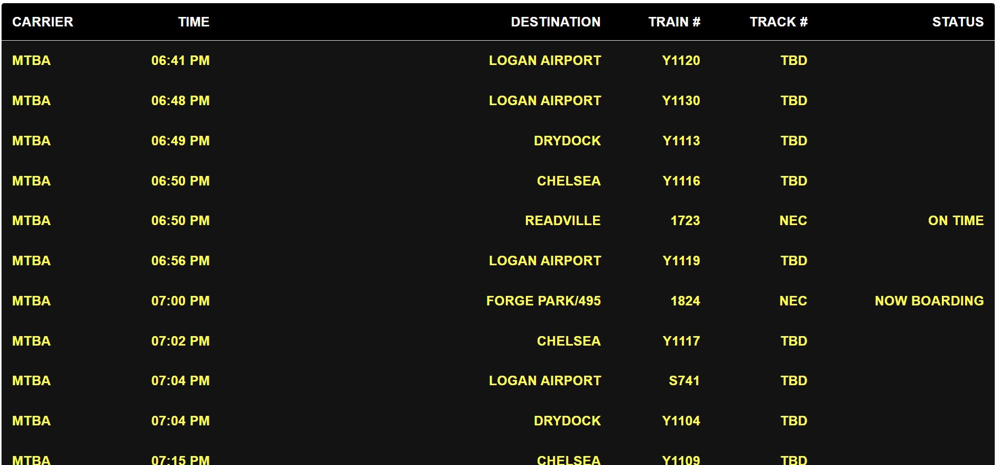

# mbta-departure-board-react-axios-material

# 🚀 website that shows a commuter rail departure board using MBTA's API 🚀

https://github.com/coding-to-music/mbta-departure-board-react-axios-material

From / By https://github.com/jpresagios/departure-board


## Environment variables:

```java

```

## GitHub

```java
git init
git add .
git remote remove origin
git commit -m "first commit"
git branch -M main
git remote add origin git@github.com:coding-to-music/mbta-departure-board-react-axios-material.git
git push -u origin main
```

# Insurify Take-home Assignment

I hope you like the work I have done. I have try to give a good solution to the challenge, always knowing that it's posible to improve what I have done.

To have installed:

- Nodejs

  ```
  https://nodejs.org/en/download/
  ```

Install requirements

```
npm install
```

How to run app

```
npm run start
```

How to run tests

```
npm run test
```

Enviroment

To provide your own api key mtba please added to .env
a new variable with the name REACT_APP_MBTA_APIKEY


